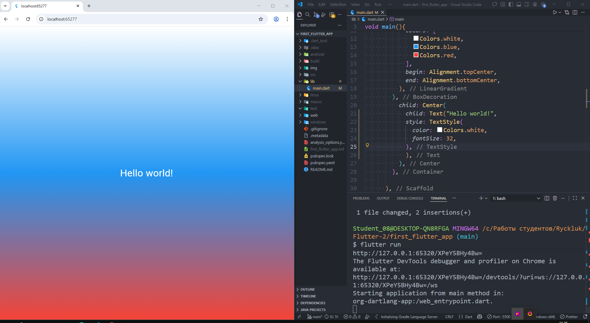

# Flutter Лабораторная работа №2: Знакомство с Flutter

## Общая информация

**Цель работы:** изучение основ кроссплатформенной разработки с использованием Flutter. Создание и запуск первого Flutter-проекта в браузере Chrome.
## Информация об авторе
- **ФИО:** Рыхлюк Надежда
- **Группа:** ISP-233

## Используемые инструменты

* **Flutter SDK:** версия 3.41.5
* **Dart SDK:** версия 3.11.3
* **IDE:** Visual Studio Code
* **Браузер:** Microsoft Edge

## Скриншот работающего приложения



## Инструкция по запуску

Для запуска проекта выполните следующие шаги:

```bash
# Клонирование репозитория
git clone <URL_репозитория>

# Переход в директорию проекта
cd Flutter_Lab2

# Установка зависимостей
flutter pub get

# Запуск приложения
flutter run -d edge
```

## Что изучили
В ходе выполнения лабораторной работы были изучены следующие темы:
* Основы структуры Flutter-проекта и назначение основных папок (lib/, pubspec.yaml).
* Базовые виджеты: MaterialApp, Scaffold, Container, Center, Text.
* Принципы работы с состоянием и отличие StatelessWidget от StatefulWidget.
* Инструменты разработки: Hot Reload, Hot Restart, Flutter DevTools и Flutter Inspector.
* Стилизация интерфейса: использование цветов, градиентов (LinearGradient) и оформление текста (TextStyle).